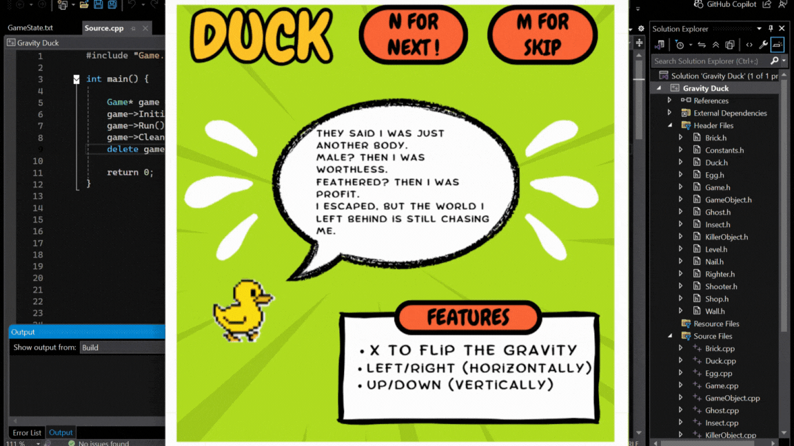
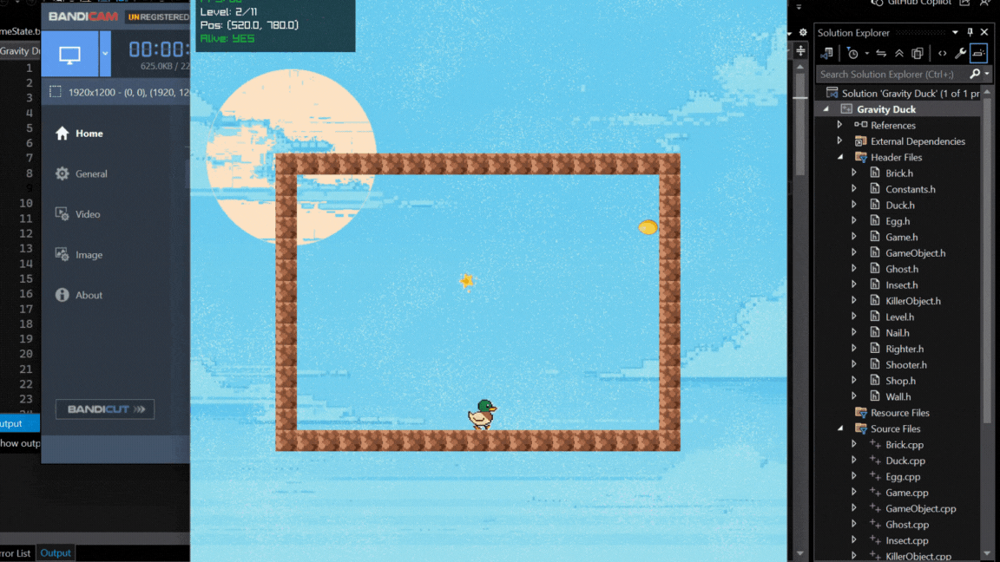
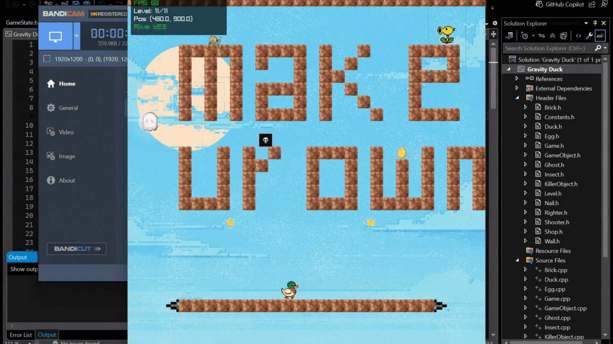

# 🦆 Gravity Duck

A platformer with purpose —
**"Gravity Duck"** reimagines a classic arcade-style puzzle game into a powerful metaphor for the real-world brutality faced by ducks in industries such as fashion and farming.

---

## 🎮 Gameplay Features

* **Gravity Flipping Mechanics**: Flip gravity with `X` key.

  * Horizontal Gravity: Use `←` and `→` keys to move.
  * Vertical Gravity: Use `↑` and `↓` keys to move.

* **Level Navigation**:

  * `R`: Reload current level
  * `W`: Skip to next level (debug/testing)
  * `O`: Go to previous level
  * `E`: Exit level to main menu

* **Objective**:

  * Each level contains **an egg**. Collecting it transports the duck to the next level.

* **Awareness Slides**:

  * Before gameplay begins, players are presented with slides that reflect **duck cruelty awareness**.
  * Use `N` to move to the next slide.
  * Use `M` to skip all slides and begin gameplay directly.
    
    ---
## ❤️ Awareness Slides:


    ---
    

* **Game Completion**:

  * After finishing all levels, a **win screen** appears with options:

    * Back to Main Menu
    * Restart Game

---

## 🛍️ In-Game Stores

### 🥚 Exchange Store:

* Trade collected **eggs for gold coins**.
* Exchange rate is dynamic (e.g., `3.45 coins/egg`), updates after each transaction.

### 🧢 Skin Store:

* Purchase duck skins using your coins.
* Skins:

  * Default (always available)
  * 2 purchasable skins
  * 1 **rare skin**, **only unlockable via gambling**.
* Brutality awareness quotes are displayed on each store screen.

### 🎰 Gambling Store:

* Gamble with eggs to win:

  * A new egg
  * 30 coins
  * Nothing
  * The rare skin

---

## 💾 Game Progress Saving

* Game state is stored in `GameState.txt`, including:

  * Number of eggs collected
  * Total coins
  * All unlocked skins
  * Last selected skin

---

## 🧱 Levels

# 🥇 LEVEL:



---

* The levels are a **replica of Gravity Duck** original level structure.
* Implemented through **text-based level files** (e.g., `level1.txt`, `level2.txt`...)
* You can **create infinite levels** using your own `.txt` files.
* Refer to `Level_Design_Manual.pdf` in the repo for formatting.

📄 **Level Design Manual:** `Level_Design_Manual.pdf`

---
Level Structure !
📘 Structure Manual : [Level_Design_Manual.pdf](./Level_Design_Manual.pdf)
---

## 🎯 Final Gameplay Snapshot:



---

## 📖 Project Motivation

**Gravity Duck** was developed not just as a game, but as an **awareness platform**. The objective is to reflect the cruelty ducks face in real life — including:

* **Mass-killing of male ducklings**, discarded as “useless”
* **Live-plucking of ducks** in the down feather industry

Each obstacle in the game personifies a real-world contributor to duck brutality — turning gameplay into a symbolic rescue mission.

🔗 [“Down Production: Birds Abused for Their Feathers” (PETA)](https://www.peta.org/features/down-investigation/)

🔗 [“Live Ducklings Ground Up” (PETA )](https://investigations.peta.org/culver-duck-whistleblower/)

> The goal: **awareness, empathy, and a call to question comfort built on cruelty**.

---

## 📂 Project Structure

```
📦 Gravity Duck Repository
├── 📁 assets
│   ├── 📁 levels
│   ├── 📁 pngs
│   ├── 📁 slides
│   └── 📁 sounds
├── 📁 code
├── 📄 gif1.gif  (Awareness Slides)
├── 📄 gif2.gif  (In-Game Level)
├── 📄 gif3.gif  (Final Level — resized below)
├── 📄 Documentation.pdf
├── 📄 Level_Design_Manual.pdf
├── 📄 CREATOR_NOTE.txt
└── 📄 README.md
```

> 📌 Make sure the `assets/` folder is placed in the **same directory** as the `.sln` file.
---
CODE STRUCRURE!
📘 Whole Structure Along with Key Points: [Documentation.pdf](./Documentation.pdf)
---

## 🛠️ Tech Stack

* **Language**: C++
* **Graphics Library**: [Raylib](https://www.raylib.com/)

---

## ✍️ Creator Info

**👨‍💻 Game Developed by:** Abdullah Nawaz
📅 Completion Date: *August 5, 2025*
📧 Email: [abdullahforecasts@gmail.com](mailto:abdullahforecasts@gmail.com)

🔗 GitHub: [github.com/abdullahforecasts](https://github.com/abdullahforecasts)
🔗 LeetCode: [leetcode.com/u/Abdullah\_Nawaz](https://leetcode.com/u/Abdullah_Nawaz)
🔗 LinkedIn: [Abdullah Nawaz](https://www.linkedin.com/in/abdullah-nawaz-a756b2310)

👉 If you liked the project, **follow me and give it a ⭐ on GitHub!**

🙏 Consider donating to animal protection organizations like **PETA** to support real-world impact.

---
