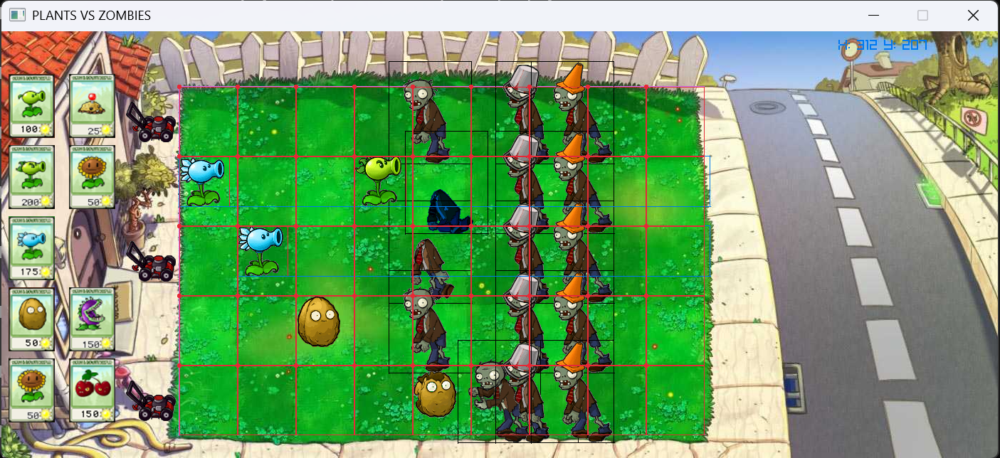
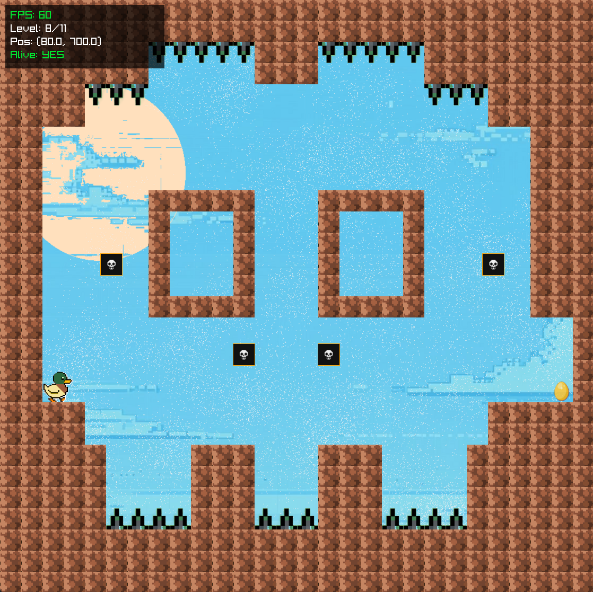
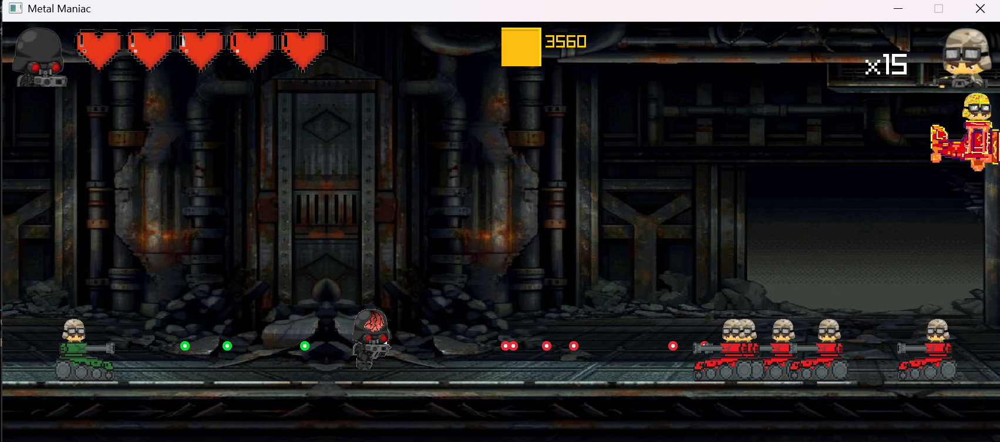
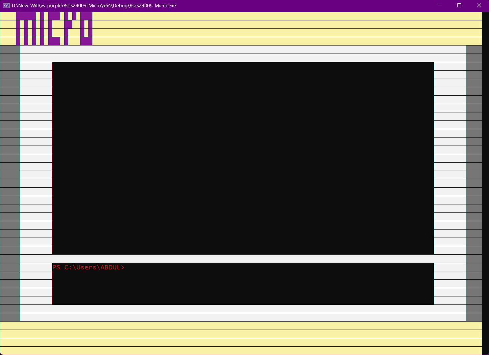
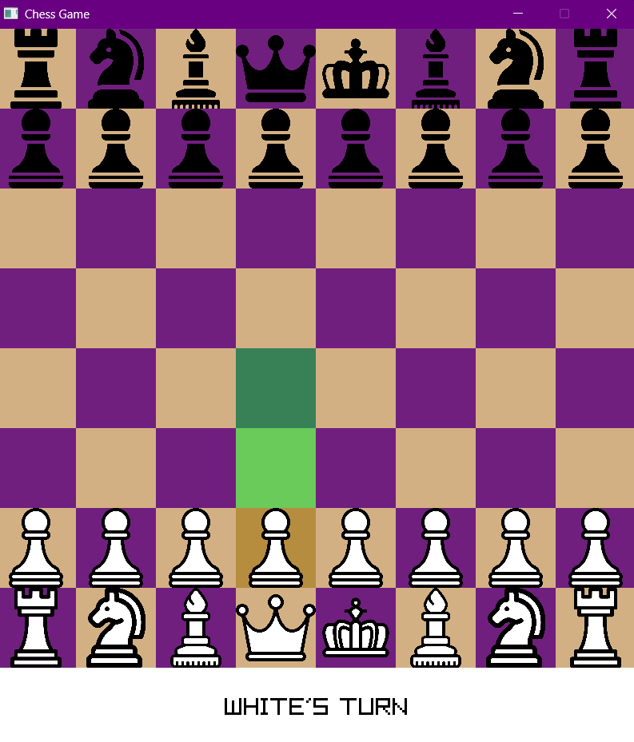
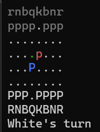
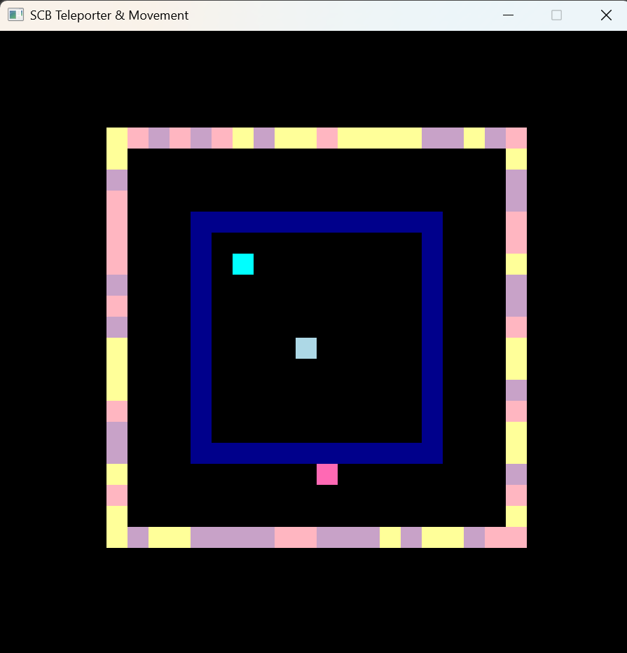
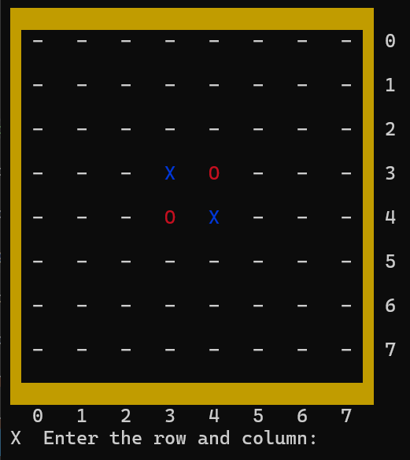

# Projects Overview

Welcome to my **Projects Overview Repository**! 🚀
Here you can find a showcase of my projects with their preview images and links to their documentation.

---

## 🌱🧟 Plants vs Zombies Project

  
📖 [View Documentation](https://github.com/abdullahforecasts/Projects_Overview/blob/main/Plants_Vs_Zombies/Readme.md)

---

## 🦆 Gravity Duck Project

  
📖 [View Documentation](https://github.com/abdullahforecasts/Projects_Overview/blob/main/Gravity_Duck/Readme.md)

---

## 🎮 Metal Maniac Project

  
📖 [View Documentation](https://github.com/abdullahforecasts/Projects_Overview/blob/main/Metal_Maniac/Readme.md)

---

## ✍️ Micro Editor UI Project

  
📖 [View Documentation](https://github.com/abdullahforecasts/Projects_Overview/blob/main/Micro_Editor/Readme.md)

---

## ♟️ Chess Project

  
📖 [View Documentation](https://github.com/abdullahforecasts/Projects_Overview/blob/main/Chess/Readme.md)

---

## ♟️ Console Chess Project

  
📖 Documentation coming soon.

---

## 🔲 Grid Teleport Project

  
📖 Documentation coming soon.

---

## ⚫⚪ Reversi Project

  
📖 Documentation coming soon.

---

## 🎥 Project Video

🎬 [Watch Video](Video.mp4)

---

✨ This repository is a quick **visual showcase** of all my projects. You can explore each project’s documentation in the linked folders.
